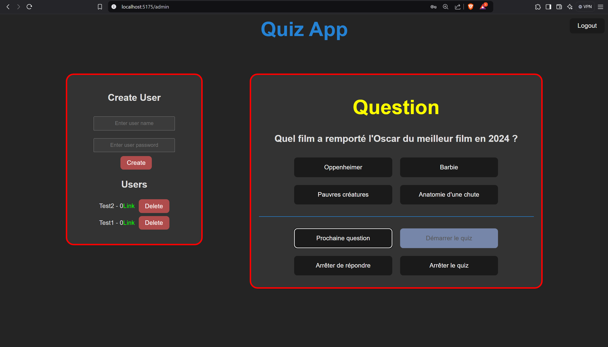
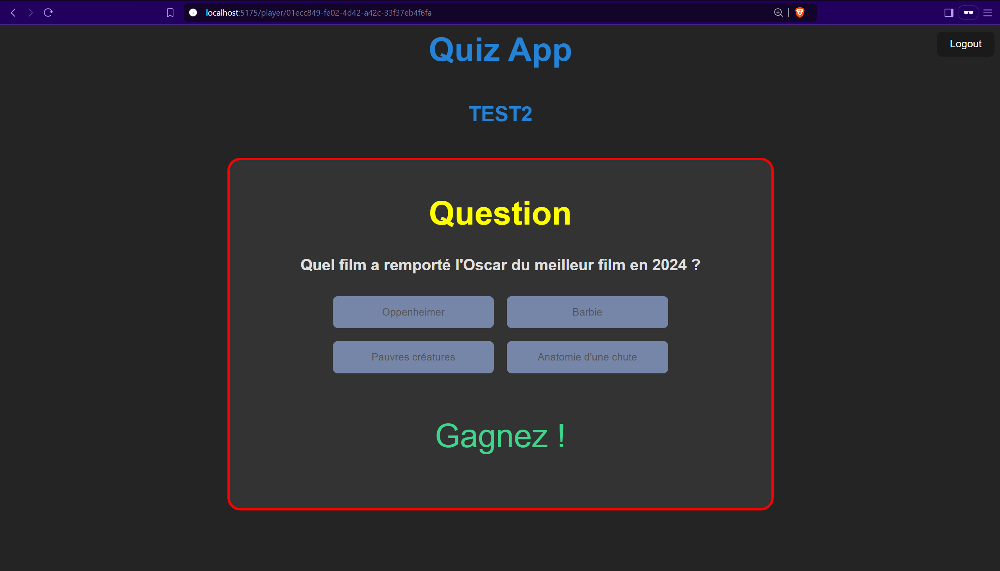

# Functionality Overview

This document provides an overview of the features and functionalities of the application, including both **Admin** and **User** pages.

## Admin Page

### Manage Users, Questions, and Live Responses
The Admin Page provides tools to efficiently manage the quiz, users, and real-time responses. Below is an example view of the admin interface:  

### User Management Features
- **View and Create Users**: Admins can view the list of users and create new ones.
- **Delete Users**: Users can be removed as needed.
- **Monitor User Activity**: Admins can track user scores live and see who is answering questions in real-time.

### Question Management Features
- **Start the Quiz**: The admin has control over when the quiz begins.
- **Next Question**: Move to the next question at any time during the quiz.
- **Restrict Answering**: Stop users from answering questions when necessary.
- **End the Quiz**: Terminate the quiz and view the results summary.

## User Page

Users have access to a dedicated interface to interact with the quiz.  
Below is an example of the user view:  

### User Features
- **Answer Questions**: Users can view the question and submit their answers.
- **Quiz Results**: At the end of the quiz, users can see their results and scores.

